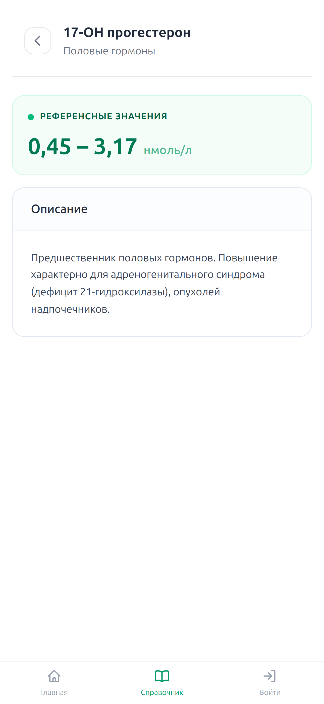
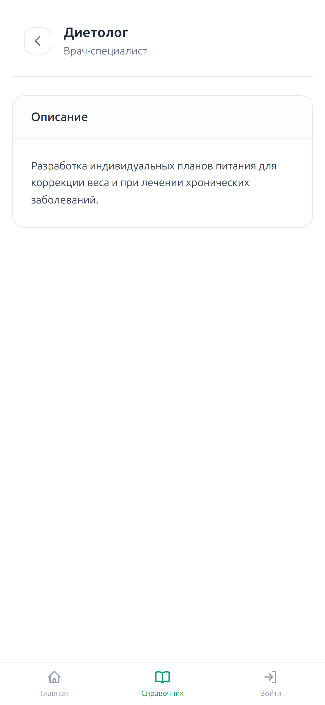

# Biometric

**Biometric** — минималистичная платформа для мониторинга личного здоровья: запись медицинских показателей и анализ динамики. Централизует результаты измерений (глюкоза, холестерин, креатинин и другие), помогая отслеживать изменения и вовремя замечать отклонения от нормы.

## Скриншоты

### Основное
| Главная | Список измерений | Аналитика |
|:---:|:---:|:---:|
|  |  |  |

### Добавление измерения (пошагово)
| Шаг 1: Выбор типа |              Шаг 2: Ввод даты               |            Шаг 3: Ввод значения             |
|:---:|:-------------------------------------------:|:-------------------------------------------:|
|  |  |  |

### Справочник
| Справочник | Показатели | Детали показателя |
|:---:|:---:|:---:|
|  |  |  |

| Детали категории | Детали профессии | Детали врача |
|:---:|:---:|:---:|
|  |  |  |

### Профиль и безопасность
| Профиль | Смена пароля | О приложении |
|:---:|:---:|:---:|
|  |  |  |

### Аутентификация
| Вход | Регистрация |
|:---:|:---:|
|  |  |

## Возможности

- **Комплексный учёт** — ведение биохимии, гормонов и жизненных показателей.
- **Визуальная аналитика** — интерактивные графики с отображением референсных значений.
- **Пошаговый интерфейс** — удобный многошаговый процесс добавления записей.
- **Справочник** — просмотр показателей и профессий с нормами и описаниями.
- **Безопасный доступ** — интеграция OAuth2 (Google) и управление паролем.
- **Адаптивный дизайн** — полная оптимизация для десктопа и мобильных устройств.

## Технологии

- **Бэкенд:** Java 25, Spring Boot 4.0.5, Spring Security (OAuth2), Spring Data JDBC
- **База данных:** PostgreSQL, Flyway
- **Фронтенд:** FreeMarker, Tailwind CSS, Vanilla JavaScript
- **Инфраструктура:** Docker (Paketo Buildpacks), Maven

---
Создано [Stanislav Smirnov](https://github.com/surofu)