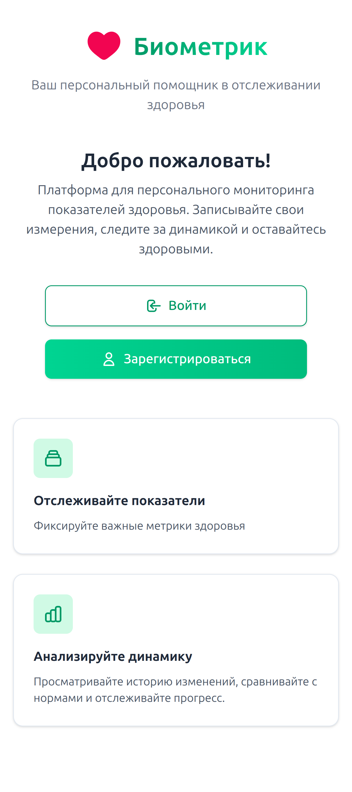
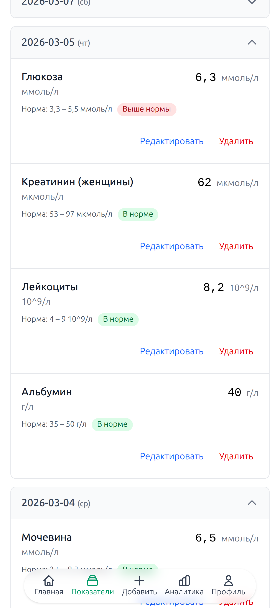
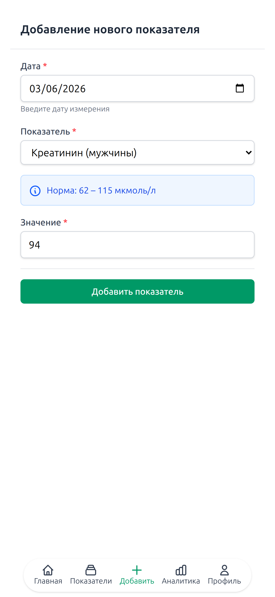
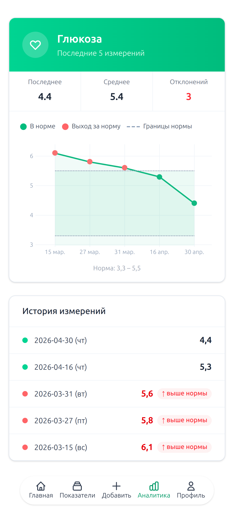

# Биометрик

**Биометрик** — веб-приложение для персонального мониторинга показателей здоровья. Оно собирает в одном месте результаты ваших измерений (давление, глюкоза, холестерин и другие), помогает отслеживать их динамику и вовремя замечать отклонения от нормы. Больше не нужно хранить разрозненные записи — всё под рукой в удобном и безопасном сервисе.

## Скриншоты

| Главная страница | Список измерений |
|:---:|:---:|
|  |  |

|              Добавление измерения               | Аналитика |
|:-----------------------------------------------:|:---:|
|  |  |

## Возможности

- 📊 **Учёт измерений** — добавляйте, редактируйте и удаляйте результаты.
- 📈 **Аналитика** — наглядные графики с границами нормы.
- 🗂️ **История** — все записи группируются по датам.
- 🔐 **Безопасность** — защищённый вход и надёжное хранение данных.

## Технологии

- Java 25
- Spring Boot 4.0.3
- Spring MVC
- Spring Security
- Spring Data JDBC
- PostgreSQL
- FreeMarker
- Liquibase